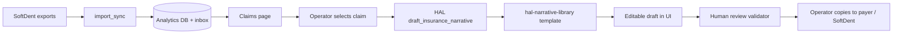
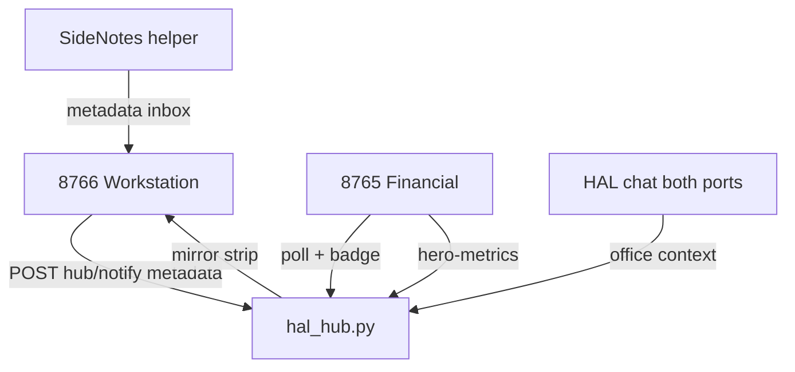

# New Ridge Financial 2.0 — Detailed Plan & Report

**Document type:** Moonshot post-ceiling operational plan  
**Date:** 2026-07-08  
**Build baseline:** `hal-10085`  
**Program:** NewRidgeFinancial 2.0 (solo dental practice — New Ridge Family Dental)  
**Authoring:** Synthesized from Moonshot consultations, codebase audit, and operator request (2026-07-08)  
**Related:** `MOONSHOT_COMPREHENSIVE_CONSULT_2026-07-08.md`, `MOONSHOT_SOFTDENT_EXTRACT_REPORT_2026-07-08.md`, `MOONSHOT_FULLEST_EXTENT_COMPLETE_2026-07-09.md`

**Live reload:** `https://127.0.0.1:8765/?v=hal-10085&__nr2_purge=1`  
**Workstation:** `https://127.0.0.1:8766/workstation/index.html?v=hal-10085`

---

## Executive summary

New Ridge Financial 2.0 has reached the **Moonshot practical ceiling for presentation and HAL spectacle** (builds hal-10078 through hal-10085). The financial cockpit, HAL hub, workstation, validators, CPA export, Tier S2 filters, storyboard export, and Tier S3 semantic zoom / presence / hero mirror are **implemented and passing automated validation**.

The program is **not yet at data and workflow ceiling**. The operator cannot rely on daily claims narrative assistance, full collections analytics, operatory scheduling, or deep insurance claim status until SoftDent extraction gaps are closed and the legacy insurance narrative workflow is ported into NR2.

### Strategic shift (post hal-10085)

| From | To |
|------|-----|
| Layout, mockup parity, HAL UI tiers | **Data depth** and **operator workflows** |
| Visual feature commits | **Import contract** and **analytics wiring** commits |
| Template-only narratives | **HAL-assisted drafts** from clinical notes + human review |
| Ad-hoc repo growth | **Archive, commit, push** hygiene |

### Top outcomes (90-day horizon)

1. **Collections and adjustments visible** — `sd_payments` and `sd_adjustments` populated; collections daily and adjustment log widgets show live data.
2. **Claims narrative assist** — Operator selects a claim, HAL drafts a narrative from SoftDent clinical notes using `hal-narrative-library.js`; operator edits; no auto-submit.
3. **Operatory and procedures depth** — Dedicated exports ingested; operatory grid and claims procedure detail non-empty when SoftDent has data.
4. **Hub + workstation signed off** — Manual 8766→8765 broadcast and hero mirror verified; desktop shortcuts current.
5. **Repo clean and backed up** — Consultation scripts committed; `_legacy` archived after narrative port; `main` pushed to remote.

### Estimated effort (solo developer)

| Phase | Theme | Commits | Calendar (part-time) |
|-------|-------|---------|----------------------|
| A | Repo hygiene & operator polish | 1–2 | Week 1 |
| B | SoftDent payment/adjustment fix | 1 | Week 1–2 |
| C | Procedures + operatory exports | 2 | Week 2–4 |
| D | Claims narrative + HAL tools | 2–3 | Week 3–6 |
| E | QuickBooks depth + cross-domain HAL | 1–2 | Week 5–8 |
| F | ODBC deep extract (optional) | 2 | Week 8–12 |

---

## Part I — Situation report (as-is)

### 1.1 System inventory

```
C:\NewRidgeFamilyFinancial\
├── StartProgram.bat          → 8765 Financial + HAL (browser)
├── StartWorkstation.bat      → 8766 Office Workstation (pywebview)
├── NewRidgeFinancial2/       → Active application (Python + vanilla JS)
├── app_data/nr2/             → Runtime (gitignored): imports, DB, hub, backups
├── _legacy/                  → Old FastAPI stack (~650 files) — archive candidate
├── frontend/ + app/          → Superseded parallel stacks
└── scripts/                  → Launchers, validators, Moonshot consultation runners
```

### 1.2 Application architecture

| Layer | Technology | Notes |
|-------|------------|-------|
| HTTP server | `browser_app.py` / `workstation_app.py` → `nr2_http_server.py` | Same codebase; mode flag splits 8765 vs 8766 |
| Frontend | `site/page-schema.js`, `page-canvas.js`, `app.js` | Moonshot mockup epoch; no React |
| Analytics DB | SQLite (`softdent_financial_analytics.db`) | Populated from `C:\SoftDentFinancialExports` |
| HAL | Ollama @ `127.0.0.1:11434`, `hal-chat:8b` pinned | `hal-agent-programming.js` v13 |
| Hub | `hal_hub.py` → `app_data/nr2/office/` | Metadata-only cross-port messaging |
| SideNotes | `sidenotes-helper/` + VistaDB COM | Metadata on 8765; full IM on workstation path |

### 1.3 Build completion matrix (Moonshot visual/HAL program)

| Build | Deliverable | Status |
|-------|-------------|--------|
| hal-10078 | Layout emergency (12-col, KPI math) | Done |
| hal-10079 | Chart unification | Done |
| hal-10080 | Page flow reorder | Done |
| hal-10081 | HAL S0 (mosaic, scrollback) | Done |
| hal-10082 | HAL S1 (situational hero, agent loop) | Done |
| hal-10083 | Tier S2 filters, compare mode | Done |
| hal-10084 | Storyboard export, chart polish | Done |
| hal-10085 | Tier S3 zoom, presence, hero mirror, citations | Done |

**Validator snapshot:** `validate-hal.mjs` 103 suites PASS · `validate-pages.mjs` PASS · `audit-mockup-parity.mjs` 10/10.

### 1.4 Git and repo state (2026-07-08)

- Branch `main` is **10 commits ahead** of `origin/main` (hal-10082–10085 not pushed).
- **Untracked:** `MOONSHOT_COMPREHENSIVE_CONSULT_2026-07-08.md`, `run_moonshot_comprehensive_consult.py`, `run_moonshot_softdent_extract_analysis.py`.
- **Modified runtime:** `sidenotes-helper/sidenotes-watcher.pid` (should not commit).

### 1.5 Data lanes — live status

| Lane | Path / mechanism | Status |
|------|------------------|--------|
| **Primary SoftDent** | `C:\SoftDentFinancialExports` | **Active** — daily + 45-min refresh |
| Daysheet JSONL | `daysheet.jsonl`, `transactions_for_period.jsonl` | Ingesting; 1,226+ transactions |
| Analytics DB | `softdent_financial_analytics.db` | 1,317 financial rows, 2,815 production-by-ADA |
| Derived claims/notes | `softdent_operational_pipeline.py` | Claims CSV + clinical notes JSON from daysheet |
| **ODBC** | `softdent_odbc_extract.py` | **Idle** — `SOFTDENT_ODBC_DSN` unset |
| **Legacy bridge** | `C:\Users\mreno\SoftDentBridge\exports` | **Stale** (June 2026 samples) |
| **QuickBooks** | SDK probe + 7 report APIs | Working; cold-cache empty states need polish |
| **SideNotes** | VistaDB watcher | Metadata to inbox JSON |

### 1.6 Critical data gaps (blocks daily operator value)

| Gap | Current | Business impact |
|-----|---------|-----------------|
| `sd_payments` = 0 | Payment codes not matching daysheet | Collections daily, collection lag empty |
| `sd_adjustments` = 0 | Writeoff codes 51/52 not landing | Adjustment log empty |
| No procedures CSV in inbox | Procedures only derived shallowly | Weak insurance narratives |
| No operatory export | `operatory_schedule.json` missing | Operatory grid blank |
| Claims from daysheet only | Max ~150 derived rows | No live claim status / aging |
| Narrative workflow | Templates only; legacy workflow in `_legacy` | No HAL draft on Claims page |
| ODBC not configured | Deepest patient/claim extract unavailable | Ceiling on automation |

### 1.7 AI / GPU configuration

| Item | Value |
|------|-------|
| GPU | AMD Radeon RX 9060 XT, 16 GB VRAM |
| Models path | `D:\LocalAI\ActiveModels` |
| Pinned chat | `hal-chat:8b` (DeepSeek-R1 8B) |
| Helper | `hal-helper:14b` disabled (speed-first) |
| On-demand reasoning | `mistral-small3.1:24b-fast`, `qwen3:30b` |
| Cloud consult | Moonshot/OpenRouter **401** — keys need refresh |

---

## Part II — Gap analysis by domain

### 2.1 Repository & engineering hygiene

**Strengths:** Clear canonical launchers; comprehensive validators; Moonshot doc trail; gitignore covers runtime dirs.

**Weaknesses:** Large `_legacy/` and duplicate stacks increase confusion; broken `run_insurance_narrative_dry_run.py`; consultation scripts uncommitted; remote backup lagging.

**Risk if unaddressed:** Developer time lost navigating dead code; narrative port blocked; loss of 10 local commits if disk failure.

### 2.2 SoftDent extraction

**Strengths:** Production export lane working; rich daysheet pipeline; ODBC module and admin API exist; import_sync orchestration mature.

**Weaknesses:** Payment/adjustment classification mismatch between `softdent_operational_pipeline.py` (codes `2`, `51`, `52`) and daysheet row shapes in `_populate_from_daysheet`; several analytics tables empty despite CSV files present for some domains.

**Root cause (payments):** `_is_payment()` in `softdent_odbc_extract.py` uses `INSURANCE_PAYMENT_CODES` and prefix heuristics, but daysheet rows may use numeric codes or negative production amounts that never enter the payment branch.

### 2.3 QuickBooks

**Strengths:** Seven report endpoints; monthly sync; reconciliation widget; CPA packet export.

**Weaknesses:** Balance sheet proxy when probe lacks detail; no automated SoftDent-vs-QB deposit variance; QBO OAuth not configured.

### 2.4 Claims & clinical narratives

**Strengths:** `hal-narrative-library.js` (10 focus types, tones, tag matching); clinical notes JSON from daysheet; Claims page and Narratives page in schema; legacy full workflow in `_legacy/app/insurance_narratives/`.

**Weaknesses:** No HAL tool for draft generation; no procedure-level join on claim rows; no client-side validator ported from legacy `review.py`; operator must use HAL chat manually.

### 2.5 Workstation, SideNotes, HAL hub

**Strengths:** Phase 5 protocol documented; metadata-only 8765 compliance; hero mirror (hal-10085); hub token and LAN checks in server.

**Weaknesses:** Manual broadcast sign-off not recorded; protocol doc vs implementation drift on security details; workstation and SideNotes remain separate UX surfaces.

### 2.6 Operator experience

**Strengths:** Desktop shortcut scripts exist; disaster recovery doc; operator runbook; nightly SQLite backup.

**Weaknesses:** Shortcuts may show stale build string; sign-off live tests skip when servers down; MOONSHOT API key invalid for future consultations.

---

## Part III — Target state (to-be)

### 3.1 Data target

| Table / file | Target row count / presence | Source |
|--------------|----------------------------|--------|
| `sd_payments` | > 0 after each sync | Fixed daysheet + register JSONL parsing |
| `sd_adjustments` | > 0 when writeoffs exist | Codes 51, 52 + writeoff JSONL |
| `procedures.csv` (inbox) | Present daily | SoftDent report export task |
| `operatory_schedule.json` | Present or explicit empty | New export job |
| `softdent_claims_export.csv` | Enriched with procedure IDs | Pipeline join |
| QB deposit variance | HAL briefing item | New analytics function |

### 3.2 Workflow target — claims narrative



**Non-negotiable:** No auto-submit to payers; no SoftDent writeback; PHI stays local.

### 3.3 Hub target



---

## Part IV — Detailed implementation plan

### Phase A — Repo hygiene & operator polish

**Goal:** Clean repo surface, backup commits, operator-ready launchers.  
**Build target:** `hal-10086` (hygiene only, no feature regression)

| ID | Task | Files / commands | Acceptance criteria |
|----|------|------------------|---------------------|
| A1 | Commit consultation scripts | `scripts/run_moonshot_*.py`, `docs/MOONSHOT_COMPREHENSIVE_CONSULT_2026-07-08.md` | On `main`; not in .gitignore |
| A2 | Refresh desktop shortcuts | `RefreshDesktopShortcuts.bat` | Both shortcuts show `hal-10085+`; legacy shortcuts warned |
| A3 | Push to origin | `git push origin main` | Remote matches local 10+ commits |
| A4 | Document `_legacy` archive plan | `docs/LEGACY_ARCHIVE_PLAN.md` | List files to port before zip/branch |
| A5 | Fix or remove broken narrative dry-run | `scripts/run_insurance_narrative_dry_run.py` | Script runs or deleted with note |
| A6 | Regenerate Moonshot/OpenRouter API key | Operator env vars | `run_moonshot_comprehensive_consult.py` returns kimi-k2.6 text |
| A7 | Dual-server sign-off | `node scripts/run-moonshot-operator-signoff.mjs` | ≥8/10 PASS with 8765+8766 up |

**Dependencies:** None.  
**Risk:** Low.

---

### Phase B — SoftDent payment & adjustment fix (P0)

**Goal:** Populate `sd_payments` and `sd_adjustments`; unlock collections widgets.  
**Build target:** `hal-10087`

| ID | Task | Files | Acceptance criteria |
|----|------|-------|---------------------|
| B1 | Audit daysheet payment rows | Manual: inspect `daysheet.jsonl` code values | Document actual code set used by SoftDent v19 |
| B2 | Unify payment/adjustment constants | `softdent_operational_pipeline.py`, `softdent_odbc_extract.py` | Single shared `INSURANCE_PAYMENT_CODES`, `INSURANCE_WRITEOFF_CODES` import |
| B3 | Fix `_populate_from_daysheet` branching | `softdent_odbc_extract.py` ~L266–350 | Payments use negative production / code `2` / register JSONL |
| B4 | Ingest `register_for_period.jsonl` into payments | `softdent_odbc_extract.py` or new helper | Register rows → `sd_payments` |
| B5 | Wire `writeoff_totals.jsonl` to adjustments | Same | `sd_adjustments` > 0 when writeoffs exist |
| B6 | Unit tests | `test_softdent_odbc_extract.py` | Tests pass with fixture containing codes 2, 51, 52 |
| B7 | Widget verification | `nr2_softdent_daily.py`, SoftDent page | Collections daily + adjustment log show non-empty after sync |
| B8 | Update extract report doc | `MOONSHOT_SOFTDENT_EXTRACT_REPORT` addendum | Gap marked closed |

**Technical note:** `softdent_odbc_extract.py` already imports `INSURANCE_PAYMENT_CODES` from operational pipeline — verify daysheet `_load_daysheet_transactions` field names (`code` vs `adaCode`) match production JSONL.

**Dependencies:** Phase A optional.  
**Risk:** Medium — requires production daysheet sample validation.

---

### Phase C — Procedures & operatory exports (P1)

**Goal:** Richer claims data and operatory grid.  
**Build targets:** `hal-10088`, `hal-10089`

#### C1 — Procedures export contract

| ID | Task | Details |
|----|------|---------|
| C1a | Define filename | `softdent_procedures_export.csv` in `C:\SoftDentFinancialExports` |
| C1b | Add to import-manifest | `import-manifest.json` new dataset key `softdent.procedures` |
| C1c | Loader + analytics table | `import_loader.py`, optional `procedures_detail` table |
| C1d | Join to claims pipeline | `softdent_operational_pipeline.py` — attach procedure list per claim row |
| C1e | Claims widget | `page-canvas.js` / `services.js` — show CDT list per claim |

**Fields (minimum):** `patient_id`, `service_date`, `ada_code`, `tooth`, `surface`, `description`, `provider_id`, `fee`, `claim_id` (if available).

#### C2 — Operatory schedule export

| ID | Task | Details |
|----|------|---------|
| C2a | Define filename | `operatory_schedule.json` |
| C2b | Export automation | Extend SoftDent financial export scheduled task (operator-side) OR ODBC query when configured |
| C2c | Canonical contract | Replace `operatoryChairs \|\| chairSchedule \|\| scheduleChairs` fallback with one required schema |
| C2d | Empty state | `page-canvas.js` — "No operatory schedule available" when file missing |
| C2e | Validator | `validate-hal.mjs` assert empty-state string |

**Dependencies:** Phase B recommended (same export folder discipline).  
**Risk:** Medium — operatory export may require SoftDent report configuration by operator.

---

### Phase D — Claims narrative workflow + HAL (P0/P1)

**Goal:** Operator drafts insurance narratives from clinical notes with HAL assist.  
**Build targets:** `hal-10090`–`hal-10092`

#### D1 — Port legacy validation rules

| Source | Target |
|--------|--------|
| `_legacy/app/insurance_narratives/review.py` | `site/narrative-review.js` (new, ~100 lines) |
| `_legacy/app/insurance_narratives/case_packet.py` | Claim packet shape in `services.js` |

**Rules to port:** Required fields (service date, CDT, tooth/surface when applicable), max length, forbidden phrases, missing clinical note flag.

#### D2 — HAL tool: `draft_insurance_narrative`

| Item | Specification |
|------|---------------|
| Tool ID | `draft_insurance_narrative` |
| Config | `site/data/hal-models.json` tools array |
| Inputs | `claimId`, `focus` (from library), `tone`, `length`, optional `denialReason` |
| Data read | `softdent.clinicalNotes` bundle + claim row from `services.js` |
| Output | Markdown/plain draft + `missingFields[]` + `citationWidgets[]` |
| Server | Optional Python helper in `hal_skills.py` for structured payload (keeps PHI server-side) |

#### D3 — Claims UI wiring

| ID | Task | File |
|----|------|------|
| D3a | "Draft with HAL" button per claim row | `page-canvas.js` or claims widget renderer |
| D3b | Modal/drawer with tone/focus selectors | Reuse `HalNarrativeLibrary` FOCUSES/TONES |
| D3c | Stream draft into editable textarea | `services.js` narratives.saveDraft |
| D3d | Run `narrative-review.js` before save | Block save if critical fields missing |
| D3e | Citation chips link to clinical note widget | Tier S3 `NR2Tier3` pattern |

#### D4 — Model routing for narratives

| Scenario | Model | Latency budget |
|----------|-------|----------------|
| Standard medical necessity | `hal-chat:8b` | < 15s |
| Denial appeal / complex | `hal-helper:14b` or `mistral-small3.1:24b-fast` on demand | < 45s |
| Cloud (no PHI) | kimi-k2.6 via OpenRouter | Architecture consult only |

**Dependencies:** Phase C1 (procedures) strongly recommended.  
**Risk:** High if clinical notes JSON lacks tooth/surface — narrative quality suffers; surface data gap in UI.

---

### Phase E — QuickBooks depth & cross-domain HAL (P1)

**Goal:** Richer QB data and SoftDent↔QB intelligence.  
**Build target:** `hal-10093`

| ID | Task | Module | Acceptance |
|----|------|--------|------------|
| E1 | Empty-state copy when QB cache cold | `nr2-qb-reports.js`, mockup chrome | Visible "Awaiting QuickBooks sync" |
| E2 | Expand SDK probe: deposits, payments received | `import_sync.py`, probe JSON schema | New keys in probe summary |
| E3 | `collection_deposit_variance()` | `nr2_analytics.py` | Compare SoftDent collections period vs QB deposits |
| E4 | HAL proactive briefing item | `hal-proactive.js` | Alert when variance > threshold (configurable) |
| E5 | F5 overlay regression test | Sign-off script or manual checklist | No duplicate chart overlays ×5 reload |

**Dependencies:** Phase B (collections data).  
**Risk:** Low–medium.

---

### Phase F — ODBC deep extract (P2, optional)

**Goal:** Patient-level, appointment, live claim rows from SoftDent SQL Server.  
**Build targets:** `hal-10094`–`hal-10095`

| Step | Action |
|------|--------|
| F1 | Install/configure read-only ODBC DSN to SoftDent SQL Server |
| F2 | Run `scripts/discover_softdent_odbc_schema.py` — save output to `app_data/nr2/softdent_schema_discovery.json` |
| F3 | Set env vars: `SOFTDENT_ODBC_DSN`, `SOFTDENT_ODBC_*_QUERY` per table |
| F4 | Consent-gated extract via UI or `POST /api/admin/extract-softdent-odbc` |
| F5 | Verify `sd_patients`, `sd_appointments`, `sd_claims` counts increase |
| F6 | Document in operator runbook — read-only login, firewall, backup |

**Dependencies:** IT/operator access to SoftDent SQL instance.  
**Risk:** High — environment-specific; not blocking Phases B–E.

---

### Phase G — Workstation / SideNotes / hub hardening (P1)

**Goal:** Recorded sign-off on cross-port behavior.  
**Build target:** can ship with Phase A or E

| ID | Test | Expected |
|----|------|----------|
| G1 | 8766 Send Message → Everyone | 8765 shows OFFICE BROADCAST badge within 15s |
| G2 | Badge content | No message body text on 8765 |
| G3 | Hero mirror | Financial KPIs appear on 8766 strip within 15s of financial page load |
| G4 | SideNotes metadata | Workstation shows sender/time; HAL can reference station name |
| G5 | Hub token rejection | POST without `X-Hub-Token` → 403 |
| G6 | Update protocol doc | `MOONSHOT_PHASE5_HUB_PROTOCOL.md` matches `_lan_hal_hub_access_ok()` behavior |

---

## Part V — HAL programming update specification

### 5.1 Agent contract bump (v13 → v14)

Trigger when Phase D ships. Add to `hal-agent-programming.js`:

- **Narrative discipline:** Never invent clinical findings; cite only imported note text.
- **Claims assist:** One draft per request; list missing fields explicitly.
- **Cross-domain:** When briefing collections vs QB, cite both import timestamps.

### 5.2 New tools (hal-models.json)

| Tool | Purpose |
|------|---------|
| `draft_insurance_narrative` | Phase D |
| `explain_claim_variance` | SoftDent vs QB collections |
| `softdent_extract_status` | Report sd_* counts + last sync (read-only diagnostic) |

### 5.3 Existing tools — no change

Patch, grep, validation, widget feed, import diagnostics remain as-is.

---

## Part VI — Desktop launcher plan

### Current assets

| Asset | Path |
|-------|------|
| Financial launcher | `StartProgram.bat` → `scripts/start_program.ps1` |
| Workstation launcher | `StartWorkstation.bat` → `scripts/start_workstation.ps1` |
| Shortcut refresh | `RefreshDesktopShortcuts.bat` |
| Icon | `assets/nr2-icon.ico` |
| Schema stamp | Read from `NewRidgeFinancial2/nr2-build.json` |

### Operator procedure (one-time, after each build bump)

```powershell
cd C:\NewRidgeFamilyFinancial
.\RefreshDesktopShortcuts.bat
```

### Optional enhancement (Phase A backlog)

- Create `Desktop\New Ridge Financial` folder with both shortcuts grouped.
- Add `Register-NR2Startup.ps1` task to auto-start 8765 at logon (operator opt-in only).

---

## Part VII — AI model strategy (16 GB Radeon)

### Recommended production layout

| Slot | Model | VRAM | Use |
|------|-------|------|-----|
| Pinned | `hal-chat:8b` | ~5–6 GB | All daily HAL chat, quick summaries |
| On-demand | `hal-helper:14b` | ~8–9 GB | Narrative drafts when 8B insufficient |
| On-demand | `mistral-small3.1:24b-fast` | ~14 GB | Denial appeals, tax reasoning |
| Avoid pin | `qwen3:30b`, 235B, 180B | OOM | Use cloud for architecture consults |

### Warmup automation

```powershell
powershell -ExecutionPolicy Bypass -File .\NewRidgeFinancial2\model-automation\Register-HAL-Model-Automation.ps1
```

### ROCm stability

Ensure `ROCBLAS_TENSILE_LIBPATH` set per `hal-models.json` hardware notes if rocblaslt errors appear in Ollama logs.

---

## Part VIII — Risk register

| ID | Risk | Likelihood | Impact | Mitigation |
|----|------|------------|--------|------------|
| R1 | Daysheet code set differs from assumptions | Medium | High | B1 audit before B3 code |
| R2 | Operator does not add procedures export task | Medium | High | Document SoftDent report steps; ODBC fallback |
| R3 | HAL narrative hallucinates clinical facts | Low | Critical | Template + review.js + "facts only from note" prompt |
| R4 | 10 unpushed commits lost | Low | High | Phase A3 push immediately |
| R5 | ODBC access denied by IT | Medium | Medium | Phase F optional; bridge lane sufficient for MVP |
| R6 | 16GB VRAM OOM during 24B narrative | Medium | Low | Queue on-demand load; show "HAL thinking" presence |
| R7 | SideNotes COM failure on station | Medium | Low | Helper logs; workstation degrades gracefully |
| R8 | Invalid Moonshot API key | Current | Low | Regenerate; use synthesized consult until fixed |

---

## Part IX — Success metrics

| Metric | Baseline | Target (90 days) |
|--------|----------|-------------------|
| `sd_payments` row count | 0 | > 50 |
| `sd_adjustments` row count | 0 | > 0 when writeoffs exist |
| Claims with procedure detail | Partial | 100% of exported claims rows |
| Operatory grid | Blank | Data or explicit empty state |
| Narrative draft time | Manual only | < 2 min with HAL assist |
| Operator sign-off | Partial SKIP | ≥ 9/10 PASS live |
| Remote backup | 10 commits behind | 0 behind origin/main |
| Hub broadcast latency | Untested | < 15s recorded |

---

## Part X — Commit roadmap (sequenced)

| Order | Build | Phase | Summary |
|-------|-------|-------|---------|
| 1 | hal-10086 | A | Commit consult docs/scripts; shortcut refresh; push origin |
| 2 | hal-10087 | B | SoftDent payment/adjustment fix + tests |
| 3 | hal-10088 | C1 | Procedures export contract + claims join |
| 4 | hal-10089 | C2 | Operatory schedule + empty state |
| 5 | hal-10090 | D1 | narrative-review.js port |
| 6 | hal-10091 | D2 | HAL draft_insurance_narrative tool |
| 7 | hal-10092 | D3 | Claims UI draft button + save flow |
| 8 | hal-10093 | E | QB empty states + deposit variance briefing |
| 9 | hal-10094 | G | Hub sign-off + protocol doc update |
| 10 | hal-10095 | F | ODBC configure + extract (if operator ready) |

Each commit must: bump `nr2-build.json`, run `validate-hal.mjs` + `validate-pages.mjs`, update sign-off BUILD constant.

---

## Part XI — Operator checklist (immediate)

- [ ] Run `RefreshDesktopShortcuts.bat`
- [ ] Start 8765 (`StartProgram.bat`) and 8766 (`StartWorkstation.bat`)
- [ ] Reload `https://127.0.0.1:8765/?v=hal-10085&__nr2_purge=1`
- [ ] Confirm SoftDent export task ran today (`C:\SoftDentFinancialExports` timestamps)
- [ ] Run `node NewRidgeFinancial2/scripts/run-moonshot-operator-signoff.mjs`
- [ ] Test 8766 Everyone → 8765 badge (no message text)
- [ ] Regenerate Moonshot API key for future consultations
- [ ] Push `main` to GitHub when satisfied with local state

---

## Part XII — Explicit non-goals (unchanged)

- No React / SPA rewrite
- No multi-tenant RBAC
- No patient messaging on 8765
- No SoftDent writeback
- No auto-submit insurance narratives to payers
- No cloud HAL mandate for PHI

---

## Appendix A — Key file reference

| Domain | Files |
|--------|-------|
| SoftDent extract | `softdent_odbc_extract.py`, `softdent_operational_pipeline.py`, `import_sync.py` |
| QB | `nr2_qb_reports.py`, `quickbooks_monthly_sync.py`, `site/nr2-qb-reports.js` |
| Claims UI | `site/services.js`, `site/page-schema.js`, `site/page-canvas.js` |
| Narratives | `site/hal-narrative-library.js`, `_legacy/app/insurance_narratives/` |
| HAL | `site/hal-agent-programming.js`, `site/data/hal-models.json`, `hal_skills.py` |
| Hub | `hal_hub.py`, `site/hal-hub-client.js`, `docs/MOONSHOT_PHASE5_HUB_PROTOCOL.md` |
| Launchers | `StartProgram.bat`, `scripts/Refresh-NR2-DesktopShortcut.ps1` |
| Validators | `validate-hal.mjs`, `validate-pages.mjs`, `scripts/run-moonshot-operator-signoff.mjs` |
| Models | `model-automation/`, `site/data/hal-models.json` |

## Appendix B — Consultation document index

| Document | Scope |
|----------|-------|
| `MOONSHOT_COMPREHENSIVE_CONSULT_2026-07-08.md` | Full Q&A synthesis |
| `MOONSHOT_SOFTDENT_EXTRACT_REPORT_2026-07-08.md` | SoftDent data depth |
| `MOONSHOT_QB_SOFTDENT_SIDENOTES_REPORT_2026-07-07.md` | QB + SideNotes conditional approve |
| `MOONSHOT_FULLEST_EXTENT_COMPLETE_2026-07-09.md` | hal-10085 completion |
| `MOONSHOT_PHASE5_HUB_PROTOCOL.md` | Hub security model |
| `OPERATOR_PILOT_RUNBOOK.md` | Daily operator procedures |
| `MOONSHOT_DISASTER_RECOVERY.md` | Backup restore |

---

**End of report.** Next actionable step: **Phase A** (commit consult artifacts, refresh shortcuts, push origin) or **Phase B** (payment/adjustment fix) if data urgency overrides hygiene.
