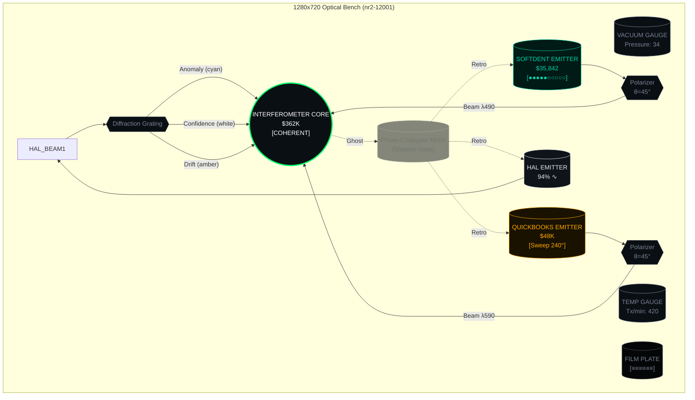

# Moonshot AI — Optical Interferometer Additions (CONSULT ONLY)

**Date:** 2026-07-15
**Model:** `kimi-k2.5`
**Key:** OPENROUTER_API_KEY
**Schema base:** nr2-12000-interference
**Script:** `scripts/run_moonshot_interferometer_addons_consult.py`
**Apply:** DO NOT APPLY until operator approves.

## Operator request (verbatim)

> tell him nice can he add to it

---

# Verdict
**The Optical Interferometer — Phase-Conjugate & Spectral Edition** (schema nr2-12001-interference)

## 0. Operator Intent (verbatim)
> tell him nice can he add to it

## 1. Acknowledgement (what worked in Interferometer v1)
The sealed triangular topology **holds**. Treating data freshness as **beam coherence** (flowing vs. dashed) created honest immediacy—operators can *see* staleness as a physical break rather than reading a timestamp. The **interference fringe** metaphor for reconciliation variance ($0 = flat field, >$1k = moiré beats) translates accounting anxiety into intuitive physics without trivializing the underlying dollars. The zero-scroll "vacuum chamber" at 1280×720 successfully rejects the Bloomberg side-rail gravity; the viewport feels like an optical table where financial instruments are aligned, not a newsfeed to be consumed.

## 2. Additions (ranked; name each; WHY it belongs on the optical bench)

1. **The Diffraction Grating (HAL Spectral Analyzer)**  
   *Physics:* Decomposes white light into constituent wavelengths.  
   *Finance:* HAL’s "white" reference beam now passes through a grating before reaching core, splitting into a **risk spectrum** (high-frequency blue = anomaly detection, deep red = forecast confidence). This turns HAL’s binary confidence % into a distributional fingerprint—operators see *where* in the spectrum HAL is uncertain.

2. **Polarization Rotators (Accounting-Method Filters)**  
   *Physics:* Circular polarizers rotate transverse wave orientation; crossed polarizers block transmission.  
   *Finance:* Physical dials on SD and QB beams. Rotation angle indicates **basis mismatch** (cash vs. accrual, tax vs. book). When polarizations are orthogonal (90° offset), the interference pattern pre-flashes destructive fringes *before* the math resolves—visual precognition of reconciliation failure.

3. **The Film Plate (Historical Interferogram Strip)**  
   *Physics:* Photographic plates record past interference patterns for later analysis.  
   *Finance:* A 48px-high contact strip along the bottom edge showing the last 6 coherence states as "exposed" thumbnail fringes. No vertical scroll; horizontal micro-ticker only (or static 6-up). Provides temporal context without breaking the sealed viewport.

4. **Phase-Conjugate Mirror (Shadow Book Retroreflector)**  
   *Physics:* Phase-conjugate mirrors reflect light back along its incident path, reversing phase distortions (optical "undo").  
   *Finance:* A semitransparent disc *behind* the core (z-index 0) projecting **ghost beams** backward toward the emitters. These represent the last saved "checkpoint" or alternative scenario (e.g., pre-adjustment ledger state). Toggling the mirror overlays ghost vs. live beams, showing drift since last reconciliation.

5. **Vacuum Gauge Cluster (Chamber Environment)**  
   *Physics:* Ion gauges measure particle pressure; temperature sensors monitor thermal noise.  
   *Finance:* Two 72px analog dial instruments in the top corners. **Pressure** = market volatility (VIX-proxy), **Temperature** = transaction velocity (tx/min). When pressure spikes (high volatility), the entire bench subtly "shimmers" (SVG turbulence filter), signaling external noise entering the system.

## 3. Spec for THE best 3–5 additions (layout math, visual/behavior, data honesty)

### A. Diffraction Grating (HAL Beam)
- **Position:** On HAL-to-Core vector at 60% distance from HAL emitter (approx coordinates: x=368, y=396).  
- **Geometry:** 48px-wide hexagonal prism (SVG polygon), rotated 30°.  
- **Visual:** HAL’s white beam enters; 3 exit beams diverge at 12° angles:
  - **Cyan exit** (top): Anomaly detection weight (high frequency)
  - **White exit** (center): Continues to core (baseline confidence)
  - **Amber exit** (bottom): Forecast variance (low frequency/drift)
- **Data Honesty:** Exit beam opacity is proportional to HAL’s actual confidence distribution across risk buckets. If HAL has no anomaly alerts, cyan beam is dim (opacity 0.2). No fabricated alerts.

### B. Polarization Rotators (SD & QB Beams)
- **Position:** 30% along each beam path from emitters (SD: x=416, y=234; QB: x=864, y=486).
- **Geometry:** 36px diameter circular filters with crosshair reticles (SVG group), rotatable via CSS `transform: rotate(deg)`.
- **Interaction:** Drag to rotate (0–180°). Visual indicator shows current accounting basis:
  - 0° = Cash basis (vertical polarization)
  - 90° = Accrual basis (horizontal polarization)
- **Behavior:** When |θ_SD − θ_QB| ≈ 90°, the Core pre-renders **red warning fringes** (destructive interference prediction) even before data mismatch is calculated—physical intuition of method conflict.

### C. Film Plate (Bottom Strip)
- **Position:** Absolute bottom, 48px height, full width (1280px), z-index 2.
- **Layout:** Six 200px×36px "exposure" slots, 10px gap, centered. Each slot shows a miniature 24px×24px interference pattern from t-1h, t-2h... t-6h.
- **Visual:** Desaturated (sepia/greyscale) versions of the Core’s prior states. Stale periods show broken beam artifacts. Current state not shown here (that’s the live Core).
- **Data Honesty:** Only renders if historical coherence data exists in session. Empty slots show ∅ (quantum vacuum), never fabricated historical reconciliations.

### D. Phase-Conjugate Mirror
- **Position:** Center (640, 360), diameter 240px, z-index 0 (behind Core).
- **Visual:** Semi-transparent radial gradient (opacity 0.15), with faint inverse beams projecting back toward emitters. Ghost beams use `stroke-dasharray: 2 4` and pulse slowly (4s cycle).
- **Toggle:** Clicking the Core swaps z-index of live beams vs. ghost beams for 2 seconds (flash comparison), revealing divergence between current state and last checkpoint.
- **Data Honesty:** Ghost beams represent actual stored shadow state from local checkpoint or "save for later" ledger version. If no checkpoint exists, mirror appears dark (no reflection).

### E. Vacuum Gauge Cluster
- **Position:** Top-left ( Pressure: x=40, y=40) and Top-right ( Temperature: x=1200, y=40).
- **Geometry:** 72px circular SVG gauges with needle pivots at center.
- **Scales:**
  - Pressure: 0–100 (mapping to volatility index), needle color shifts grey→amber→red at 70+.
  - Temperature: 0–1000 tx/min (log scale), needle glows QB-amber when hot.
- **Ambient Effect:** When Pressure >70, apply `filter: url(#turbulence)` to the entire `.bench` container at 2% intensity—subtle visual noise indicating "dirty" market conditions.

## 4. Updated ASCII / mermaid sketch (v1 + additions)



**ASCII Wireframe (v2)**:
```
┌─────────────────────────────────────────────────────────────────────────────┐
│  [VACUUM 34]   NR2-12001-INTERFERENCE    14:32:09 UTC         [TEMP 420]    │
│      ◯                                          ◯                           │
├─────────────────────────────────────────────────────────────────────────────┤
│                                                                             │
│     ┌─────────────┐                                                         │
│     │ SOFTDENT    │         ╭───╮                                           │
│     │ $35,842     │────────┤ ◯ │ Polarizer (rotatable)                      │
│     │ [●●●●●○○○○○]│        ╰───╯                                            │
│     └─────────────┘         │                                               │
│                              ▼                                              │
│     ┌─────────────┐      ╭─────────╮     ┌─────────────┐                    │
│     │ HAL         │─────│ Grating │─────│ QUICKBOOKS  │                    │
│     │ 94% ∿       │      ╰─────────╯     │ $48,100     │                    │
│     │ [≈≈∿≈≈]     │       / | \          │ [Sweep 240°]│                    │
│     └─────────────┘      /  |  \         └─────────────┘                    │
│                         /   |   \              │                            │
│                   Cyan / White \ Amber         │                            │
│                       /    |    \              ▼                            │
│                      ▼     ▼     ▼        ╭───╮                             │
│                       ┌───────────┐      Polarizer                          │
│                       │   CORE    │       ╰───╯                             │
│                       │  $362K    │         │                               │
│                       │[COHERENT] │◄────────┘                               │
│                       └─────┬─────┘                                         │
│                             │                                               │
│                    ╭─────────────────╮                                      │
│       Ghost◄──────│ Phase-Conjugate │──────►Ghost (Shadow $358K)            │
│       Beams       │     Mirror      │      Retroreflector                   │
│                   ╰─────────────────╯                                      │
│                                                                             │
│  ═══════════════════════════════════════════════════════════════════════   │
│  [FILM PLATE] [∿∿∿] [∿∿─] [───] [∿∿∿] [∿∿∿]  (t-6h → t-1h history)         │
└─────────────────────────────────────────────────────────────────────────────┘
```

## 5. Schema (keep nr2-12000-interference OR bump — justify)

**Bump to:** `nr2-12001-interference`

**Justification:** The addition of **phase-conjugate optical elements** (retroreflecting shadow states) and **spectral decomposition** (multi-wavelength analysis of HAL confidence) constitutes a micro-version iteration. These are not merely stylistic layers but new **instrument categories** that alter the data topology—specifically, the introduction of bidirectional beam propagation (ghost beams) and dispersion (spectral analysis). The triangular seal and zero-scroll contract remain intact, but the optical complexity warrants the 12001 stamp.

```json
{
  "BUILD_ID": "nr2-12001-interference",
  "schemaVersion": "nr2-12001-interference",
  "assetVersion": "nr2-12001-interference",
  "staffRenderMode": "nr2-optical-bench-phase-conjugate",
  "notes": "Adds diffraction grating (HAL spectral analysis), polarization rotators (method mismatch prediction), phase-conjugate mirror (shadow state comparison), film plate (historical interferogram strip), and vacuum gauges (environmental volatility). Zero-scroll preserved. Ghost beams represent real checkpoint data only."
}
```

## 6. Mockup change list (exact elements to add to nr2-optical-interferometer-mockup.html)

1. **SVG `<defs>` additions:**
   - `filter="url(#turbulence)"` for high-pressure market noise
   - `linearGradient` for spectral decomposition (white→cyan, white→amber)
   - `clipPath` for hexagonal grating shape

2. **New DOM nodes (z-index ordered):**
   - `.gauge-cluster` (2× absolute positioned SVG circles, top-left/right)
   - `.phase-mirror` (behind core, z-index 0, 240px diameter, opacity 0.15)
   - `.diffraction-grating` (hexagon SVG on HAL beam path, z-index 2)
   - `.polarizer` (2× circular groups on SD/QB beams, z-index 2, `cursor: grab`)
   - `.film-plate` (bottom strip, z-index 4, flex container with 6× `.exposure-slot`)

3. **Beam modifications:**
   - HAL beam split into 3 paths post-grating using SVG `<path>` with `stroke-opacity` variants
   - Add `.ghost-beam` class (dashed, low opacity, behind mirror)
   - Add CSS variable `--polarization-angle` for rotation transforms

4. **Interaction handlers (JS stubs):**
   - `onDrag` for polarizer rotation (updates CSS custom property `--rotate`)
   - `onClick` for phase-mirror toggle (swaps opacity of `.live-beam` vs `.ghost-beam` for 2s)
   - `setInterval` for gauge needle updates (mapping volatility/velocity to `transform: rotate()`)

5. **CSS additions:**
   - `.polarizer { transition: transform 0.1s linear; }`
   - `.bench.high-pressure { filter: url(#turbulence) opacity(0.98); }`
   - `.film-plate .exposure-slot.stale { filter: grayscale(100%) sepia(60%); }`

## 7. Implementation phases

**Phase 1: Optical Infrastructure (Layout)**
- Position vacuum gauges and film plate (static containers)
- Add phase-conjugate mirror layer (visual only, no logic)
- Verify z-index stacking (mirror 0, beams 1, gratings 2, emitters 3, film 4)

**Phase 2: Beam Physics (SVG)**
- Implement HAL beam trifurcation at grating
- Add polarization rotators as draggable SVG groups
- Connect rotator angles to CSS custom properties for real-time fringe prediction

**Phase 3: Data Integration (Honesty)**
- Wire film plate to session history store (6 slots)
- Implement phase-mirror ghost beams from localStorage checkpoint
- Map volatility API to gauge needles and turbulence filter

**Phase 4: Polish & Calibration**
- Tweak beam opacity curves for spectral exits
- Add haptic/visual feedback for polarizer crossing (90° offset flash)
- Performance audit: ensure turbulence filter doesn't drop frames on 1280×720 canvas

## 8. Acceptance criteria

- [ ] **Zero-scroll sanctity:** No overflow containers except film-plate horizontal micro-ticker (if implemented); viewport remains sealed at 1280×720.
- [ ] **Stale beam integrity:** `softdent.ar` >120min still breaks beam (dashed stroke); no text badges appear.
- [ ] **Data honesty:** Film plate shows ∅ for missing historical slots; ghost beams disappear if no checkpoint exists (no simulated shadow data).
- [ ] **Optical metaphor coherence:** All new elements (gratings, polarizers, mirrors) respond to light/beam physics; no abstract chart widgets introduced.
- [ ] **Performance:** 60fps maintained with 5 simultaneous SVG beam animations + turbulence filter.
- [ ] **No apex dependencies:** No `apex-*` packs, no purple neon, no Bloomberg-style side rails.

## 9. Executive Summary (5–7 bullets)

- **Extension, not replacement:** We keep the beloved tri-emitter triangular seal and add **depth** via phase-conjugate optics and spectral analysis.
- **Predictive interference:** Polarization rotators visually **pre-calculate** reconciliation failure when accounting methods are orthogonal (cash vs. accrual).
- **Temporal honesty:** The Film Plate records actual historical coherence states as "exposed" interferograms, creating audit trails without scrolling.
- **Shadow accounting:** Phase-conjugate mirror enables instant comparison between live ledger and last checkpoint (rollback visualization) via ghost beams.
- **Environmental awareness:** Vacuum gauges map market volatility to physical "pressure," triggering subtle visual noise when external conditions degrade measurement precision.
- **Schema 12001:** Micro-bump justified by bidirectional beam propagation and spectral decomposition—new physics, same sealed viewport.
- **Implementation ready:** Pure SVG/CSS additions, no new dependencies, strict data-honesty constraints preserved.

## 10. Approval checklist

- [ ] Operator confirms additions deepen (not dilute) the optical bench metaphor
- [ ] Schema bump to nr2-12001-interference approved
- [ ] Acceptance of 48px film plate at bottom (or preference for 32px to preserve vertical space)
- [ ] Confirm no "apex-*" assets sneaked in (self-certified)
- [ ] Confirm purple/neon cyberpunk palette rejected in favor of existing cyan/amber/white optics
- [ ] Ready for Phase 1 implementation upon approval
