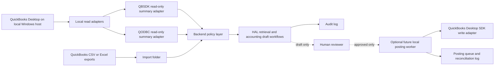

# QuickBooks Desktop Safe Architecture

This document defines the safe QuickBooks Desktop integration model for this repository.

## Goals

- Keep HAL read-only.
- Keep the QuickBooks company file local to the Windows machine running QuickBooks Desktop.
- Prevent arbitrary SQL, arbitrary QBXML, or direct AI-initiated ledger writes.
- Require deterministic validation and human approval before any posting workflow is introduced.
- Preserve an auditable trail for every accounting draft, summary read, and future posting request.

## Current Repo Boundary

The current codebase supports one production read path and one diagnostic path:

- Controlled QuickBooks Desktop SDK summary reads via `fetch_quickbooks_sdk_summary_direct(...)` in `app/services.py`.
- Admin-only QODBC diagnostics via `fetch_quickbooks_data(...)` in `app/services.py`.

HAL must remain limited to approved SDK summary topics. It must not generate or execute arbitrary SQL, arbitrary QBXML, or any QuickBooks write request.

## Recommended Architecture

## Safe Modes

### Mode 1: Export-Only Analysis

Use this when maximum privacy and minimum operational risk matter most.

- Export Profit and Loss, Balance Sheet, A/R aging, vendor detail, or other approved reports from QuickBooks Desktop to CSV or Excel.
- Drop the files into a local import folder.
- Let HAL analyze those files offline through the existing import and retrieval pipeline.
- Do not maintain any live QuickBooks connectivity for HAL in this mode.

This should be the default mode for high-sensitivity review work.

### Mode 2: Live Read-Only Desktop Summaries

Use this when the dashboard needs fresher figures than manual exports provide.

- Run the backend on the same Windows machine as QuickBooks Desktop when possible.
- Allow the backend to use the Desktop SDK for fixed summary topics only.
- Restrict the allowed topics to a short allowlist such as revenue, expenses, and A/R.
- Time-box every request and fail closed if the QuickBooks UI blocks the request.
- Continue storing only sanitized prompts and summary-level outputs in the HAL audit trail.

This matches the current repo direction and is the recommended live mode.

### Mode 3: Future Approved Posting Worker

If posting is ever added, it must not be part of HAL's direct tool surface.

- HAL or a local extraction workflow may create a draft posting request.
- A deterministic validator must normalize payee, date, amount, account, memo, duplicate risk, and document references.
- A human reviewer must approve the draft.
- A separate local posting worker may then translate the approved payload into SDK write requests.
- Every posting attempt must be logged with request payload hash, approver, timestamp, and reconciliation outcome.

The posting worker should be isolated from the conversational HAL path.

## Components In This Repo

### 1. HAL Policy Layer

HAL should remain the policy-enforced accounting assistant.

- Inputs: sanitized accounting questions, approved export files, approved summary topics.
- Outputs: draft guidance, draft journal entries, citations, review-required flags.
- Forbidden actions: posting to QuickBooks, arbitrary SQL, arbitrary QBXML, raw patient record disclosure.

### 2. Read Adapters

The read adapters should stay narrow.

- `fetch_quickbooks_sdk_summary_direct(...)`: Desktop SDK summary path for fixed report queries.
- `fetch_quickbooks_data(...)`: admin-only QODBC diagnostic path.
- `fetch_quickbooks_sdk_summary(...)`: subprocess wrapper to keep blocking Desktop SDK behavior out of the request thread.

Do not expose these adapters directly to user-generated query text.

### 3. Local Import Folder

Use a local import folder for manual or scripted exports.

- Suitable for CSV and Excel report drops.
- Safer than direct connectivity for sensitive review workflows.
- Can be scheduled with Windows Task Scheduler.

### 4. Audit Layer

Every HAL accounting and QuickBooks-assisted workflow should leave an audit trail.

- Who asked.
- Sanitized question or action summary.
- Which approved source ids were used.
- Whether the result was draft-only.
- Whether a future posting request was approved or rejected.

## Desktop Security Rules

- Keep the `.qbw` file local; do not expose the company file over SMB, RDP drive redirection, or an HTTP wrapper just so AI can reach it.
- Prefer running the backend on the same Windows host as QuickBooks Desktop.
- Bind the backend to localhost unless there is a concrete operational need to do otherwise.
- Use a dedicated QuickBooks integration app name and a dedicated Windows service account when automating.
- Limit the QuickBooks integration account to the minimum permissions required for the approved workflow.
- Treat QODBC DSNs, company-file paths, and any future SDK credentials as local secrets.
- Fail closed on timeout, UI prompt blockage, missing company file, or malformed responses.

## Allowed And Disallowed Operations

Allowed:

- Read-only summary reports.
- Approved export ingestion.
- Draft journal entry generation.
- Draft accounting policy guidance.
- Audit review.

Disallowed:

- Arbitrary SQL from model output.
- Arbitrary QBXML from model output.
- Direct posting from a chat response.
- Unreviewed vendor, bill, check, or journal writes.
- Remote network exposure of the QuickBooks Desktop file for AI convenience.

## Recommended Implementation Phases

### Phase 1

- Keep using exports and existing read-only summary topics.
- Continue routing all accounting outputs through review-required workflows.

### Phase 2

- Add a local draft-import queue for invoices or expenses.
- Add deterministic validation and duplicate checks.
- Add approval state tracking before any posting exists.

### Phase 3

- Introduce a separate local posting worker for approved payloads only.
- Add reconciliation receipts and post-write verification.

## Repo-Specific Recommendation

For this repository, the safest practical configuration is:

- Use export files by default.
- Enable live Desktop summary reads only for fixed SDK summary topics already enforced by the backend.
- Keep HAL draft-only.
- Put any future write-back into a separate local worker with approval and audit controls.

That keeps the current architecture coherent: HAL remains an audited local accounting assistant, while QuickBooks Desktop remains a local system of record that is never directly controlled by freeform AI output.
